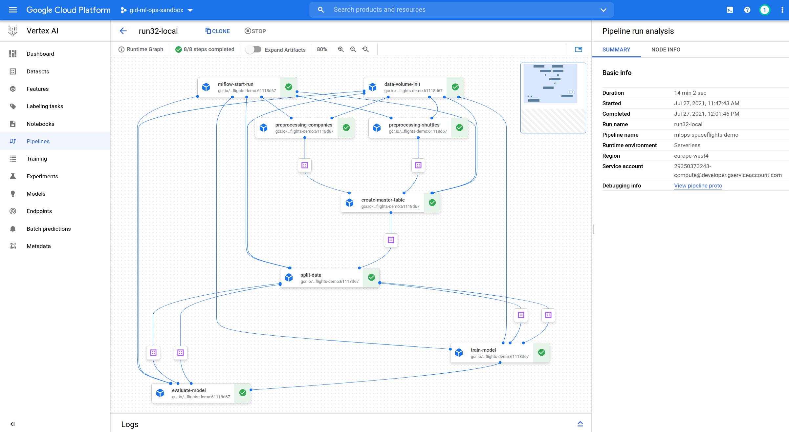

# Introduction

## What is GCP VertexAI Pipelines?

[Vertex AI Pipelines](https://cloud.google.com/vertex-ai/docs/pipelines/introduction) is a Google Cloud Platform service
that aims to deliver [Kubeflow Pipelines](https://www.kubeflow.org/docs/components/pipelines/introduction/) functionality
in a fully managed fashion. Vertex AI Pipelines helps you to automate, monitor, and govern your ML systems by orchestrating
your ML workflow in a serverless manner.

## Why to integrate Kedro project with Vertex AI Pipelines?

Throughout couple years of exploring ML Ops ecosystem as software developers we've been looking for
a framework that enforces the best standards and practices regarding ML model development and Kedro 
Framework seems like a good fit for this position, but what happens next, once you've got the code ready? 

It seems like the ecosystem grown up enough so you no longer need to release models you've trained with 
Jupyter notebook on your local machine on Sunday evening. In fact there are many tools now you can use 
to have an elegant model delivery pipeline that is automated, reliable and in some cases can give you 
a resource boost that's often crucial when handling complex models or a load of training data. With the 
help of some plugins **You can develop your ML training code with Kedro and execute it using multiple 
robust services** without changing the business logic. 

We currently support:
* Kubeflow [kedro-kubeflow](https://github.com/getindata/kedro-kubeflow)
* Airflow on Kubernetes [kedro-airflow-k8s](https://github.com/getindata/kedro-airflow-k8s)

And with this **kedro-vertexai** plugin, you can run your code on GCP Vertex AI Pipelines in a fully managed fashion 

