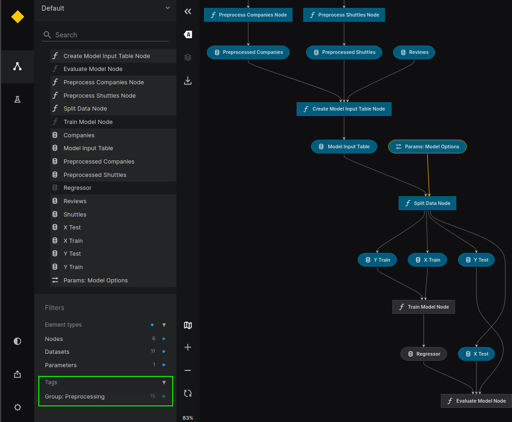
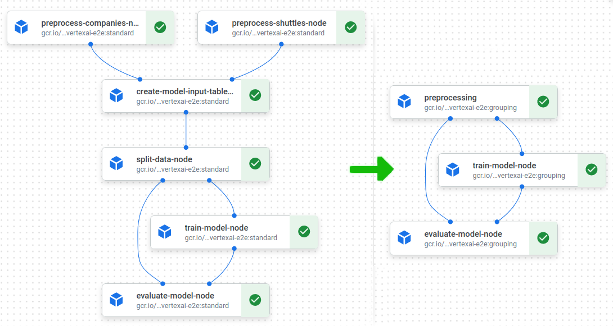

# Configuration

Plugin maintains the configuration in the `conf/base/vertexai.yaml` file. Sample configuration can be generated using `kedro vertexai init`:

```yaml
# Configuration used to run the pipeline
project_id: my-gcp-mlops-project
region: europe-west1
run_config:
  # Name of the image to run as the pipeline steps
  image: eu.gcr.io/my-gcp-mlops-project/example_model:${commit_id}

  # Pull policy to be used for the steps. Use Always if you push the images
  # on the same tag, or Never if you use only local images
  image_pull_policy: IfNotPresent

  # Location of Vertex AI GCS root
  root: bucket_name/gcs_suffix

  # Name of the kubeflow experiment to be created
  experiment_name: MyExperiment

  # Name of the scheduled run, templated with the schedule parameters
  scheduled_run_name: MyExperimentRun

  # Optional pipeline description
  #description: "Very Important Pipeline"

  # Optional config for node execution grouping. - 2 classes are provided:
  # - default no-grouping option IdentityNodeGrouper
  # - tag based grouping with TagNodeGrouper
  grouping:
    cls: kedro_vertexai.grouping.IdentityNodeGrouper
    # cls: kedro_vertexai.grouping.TagNodeGrouper
    # params:
        # tag_prefix: "group:"

  # How long to keep underlying Argo workflow (together with pods and data
  # volume after pipeline finishes) [in seconds]. Default: 1 week
  ttl: 604800

  # What Kedro pipeline should be run as the last step regardless of the
  # pipeline status. Used to send notifications or raise the alerts
  # on_exit_pipeline: notify_via_slack

  # Optional section allowing adjustment of the resources, reservations and limits
  # for the nodes. You can specify node names or tags to select which nodes the requirements
  # apply to (also in node selectors). When not provided they're set to 500m cpu and 1024Mi memory.
  # If you don't want to specify pipeline resources set both to None in __default__.
  resources:

    # For nodes that require more RAM you can increase the "memory"
    data-import-node:
      memory: 2Gi

    # Training nodes can utilize more than one CPU if the algorithm
    # supports it
    model-training-node:
      cpu: 8
      memory: 60Gi

    # GPU-capable nodes can request 1 GPU slot
    tensorflow-node:
      gpu: 1

    # Resources can be also configured via nodes tag
    # (if there is node name and tag configuration for the same
    # resource, tag configuration is overwritten with node one)
    gpu_node_tag:
      cpu: 1
      gpu: 2

    # Default settings for the nodes
    __default__:
      cpu: 200m
      memory: 64Mi

  # Optional section allowing to configure node selectors constraints
  # like gpu accelerator for nodes with gpu resources.
  # (Note that not all accelerators are available in all
  # regions - https://cloud.google.com/compute/docs/gpus/gpu-regions-zones)
  # and not for all machines and resources configurations - 
  # https://cloud.google.com/vertex-ai/docs/training/configure-compute#specifying_gpus
  node_selectors:
    gpu_node_tag:
      cloud.google.com/gke-accelerator: NVIDIA_TESLA_T4
    tensorflow-step:
      cloud.google.com/gke-accelerator: NVIDIA_TESLA_K80
      
  # Optional section allowing to generate config files at runtime,
  # useful e.g. when you need to obtain credentials dynamically and store them in credentials.yaml
  # but the credentials need to be refreshed per-node
  # (which in case of Vertex AI would be a separate container / machine)
  # Example:
  # dynamic_config_providers:
  #  - cls: kedro_vertexai.auth.gcp.MLFlowGoogleOAuthCredentialsProvider
  #    params:
  #      client_id: iam-client-id

  dynamic_config_providers: []
```

## Dynamic configuration support
The plugin relies on the project configuration and uses the same config loader that your project uses.
For some cases, you need to modify the `settings.py` to work with our plugin. Follow the instructions below.

Every Kedro Vertex AI job gets injected with two environment variables:
* `KEDRO_CONFIG_JOB_NAME` - contains name of the job from Vertex AI
* `KEDRO_CONFIG_RUN_ID` - contains unique run identifier from Vertex AI

You can consume them as you like or use them within config loaders.

### Using `OmegaConfigLoader`

`kedro-vertexai` supports `OmegaConfigLoader`. In order to configure it, update the `settings.py` file in your Kedro project as follows:

```python
from kedro.config import OmegaConfigLoader
CONFIG_LOADER_CLASS = OmegaConfigLoader
CONFIG_LOADER_ARGS = {
    # other args
    "config_patterns": {"vertexai": ["vertexai*"]}
}
```

Follow Kedro's official documentation, to see how to add templating, custom resolvers etc. (https://docs.kedro.org/en/stable/configuration/advanced_configuration.html#how-to-do-templating-with-the-omegaconfigloader)[https://docs.kedro.org/en/stable/configuration/advanced_configuration.html#how-to-do-templating-with-the-omegaconfigloader]

### Using `TemplatedConfigLoader`
`TemplatedConfigLoader` allows passing environment variables to configuration files. It reads all environment variables following `KEDRO_CONFIG_<NAME>` pattern, which you 
can later inject in configuration file using `${name}` syntax. 

This feature is especially useful for keeping the executions of the pipelines isolated and traceable by dynamically setting output paths for intermediate data in the **Data Catalog**, e.g.

```yaml
# ...
train_x:
  type: pandas.CSVDataSet
  filepath: gs://<bucket>/kedro-vertexai/${run_id}/05_model_input/train_x.csv

train_y:
  type: pandas.CSVDataSet
  filepath: gs://<bucket>/kedro-vertexai/${run_id}/05_model_input/train_y.csv
# ...
```

In this case, the `${run_id}` placeholder will be substituted by the unique run identifier from Vertex AI Pipelines.


### Dynamic config providers
When running the job in VertexAI it's possible to generate new configuration files **at runtime** if that's required, one example could be generating Kedro credentials on a Vertex AI's node level (the opposite would be supplying the credentials when starting the job).

Example:
```yaml
run_config:
  # ... 
  dynamic_config_providers:
    - cls: <fully qualified class name inheriting from kedro_vertexai.dynamic_config.DynamicConfigProvider>
      params:
        # ... params passed to the constructor of the class
        abc: value1
        xyz: value2
```

The `cls` fields should contain a fully qualified reference to a class implementing abstract `kedro_vertexai.dynamic_config.DynamicConfigProvider`. All `params` will be passed as `kwargs` to the class's constructor.
Two required methods are:
```python
@property
def target_config_file(self) -> str:
    return "name-of-the-config-file.yml"

def generate_config(self) -> dict:
    return {
        "layout": {
            "of-the-target": {
                "config-file": "value"
            }
        }
    }
```

First one - `target_config_file` should return the name of the configuration file to be generated (e.g. `credentials.yml`) and the `generate_config` should return a dictionary, which will be then serialized into the target file as YAML. If the target file already exists during the invocation, it will be merged (see method `kedro_vertexai.dynamic_config.DynamicConfigProvider.merge_with_existing` ) with the existing one and then saved again.
Note that the `generate_config` has access to an initialized plugin config via `self.config` property, so any values from the `vertexai.yml` configuration is accessible.


## Grouping feature

Optional `grouping` section enables grouping feature that aggregates many Kedro nodes execution to single VertexAI node(s). Using it allows you to freely subdivide Kedro pipelines to as many steps as logically makes sense while keeping advantages of in memory data transmission possibilities. It also saves you a lot of time avoiding delays of docker container starting at Vertex nodes which can amount to about 2 minutes for each VertexAI node.

API allows implementation of your own aggregation method. You can provide aggregating class and its additional init params as `kwargs` dictionary. Default class is `IdentitiyNodeGrouper` which actually does not group the nodes (plugin behaves as in versions before `0.9.1`). Class that implements grouping using configured tag prefix is called `TagNodeGrouper`. The default prefix is `"group:"`. It uses what follows after the tag prefix as a name of group of nodes. Only one tag with this grouping prefix is allowed per node; more than that results in `GroupingException`. Example configuration:
```yaml
  grouping:
    cls: kedro_vertexai.grouping.TagNodeGrouper
    params:
        tag_prefix: "group:"
```

The above configuration will result in the following result in this sample pipeline:
```python
Pipeline([
  node(some_operation, "A", "B", name="node1", tags=["foo", "group:nodegroup"]),
  node(some_operation, "B", "C", name="node2", tags=["bar", "group:nodegroup"]),
  node(some_operation, "C", "D", name="node3", tags=["baz"]),
])
```
The result will be 2 VertexAI nodes for this pipeline, first with name `nodegroup` that will run `node1` and `node2` Kedro nodes inside and provide output `C` and second VertexAI node: `node3`. Additional MLflow node can be present if `kedro-mlflow` is used. Right now it is not possible to group it. If you feel you need that functionality search for/create an issue on [github page of the plugin](https://github.com/getindata/kedro-vertexai/issues).

This grouping class is used during pipeline translation at plugin pipeline generator. It implements interface of `NodeGrouper` class with `group` function, that accepts `pipeline.node_dependencies` and returns `Grouping`. `Grouping` is a `dataclass` with two dictionaries:
- `node_mapping` - which defines names of groups and says which sets of nodes are part of a given group
- `dependencies` - which defines child-parent relation of all groups in `node_mapping`.
`Grouping` class also validates dependencies upon creation to check whether the grouping is valid. That means it does not introduce a cycle in dependencies graph.

````{warning}
Make sure that all nodes in pipeline have names and their names are unique within the pipeline when using this feature, as grouping class and VertexAI nodes naming depend on it.
````

### Example

Here you can see how standard spaceflights changes after enabling the grouping feature configured with `TagNodeGrouper`, when using the following tagging (view from kedro viz):



We get the following result:




## Resources configuration

Optional `resources` and `node_selectors` sections enable adjustment of the resources reservations and limits for the
selected `Kedro` nodes. Settings for individual nodes, we can define in two ways - using the name of the node or
its [tag](https://kedro.readthedocs.io/en/stable/nodes_and_pipelines/nodes.html#how-to-tag-a-node) (if there is node name and tag configuration for the same resource, tag configuration is overwritten with
node one). For example, with the `vertexai.yaml` configuration file shown at the beginning of the chapter and the `Kedro`
pipeline containing such a node:
```python
def create_pipeline(**kwargs):
    return Pipeline(
        [
            node(
                func=train_model,
                inputs=["X_train", "y_train"],
                outputs="regressor",
                name="model_training_node",
                tags="gpu_node_tag",
            ),
        ]
    )
```

we expect this particular node to run with two `NVIDIA_TESLA_T4` GPUs, eight CPUs, and memory allocated according to
the specified `60Gi` limit. (Note that not all accelerators are available in all [regions](https://cloud.google.com/compute/docs/gpus/gpu-regions-zones) and not for all [machines and
resources configurations](https://cloud.google.com/vertex-ai/docs/training/configure-compute#specifying_gpus))